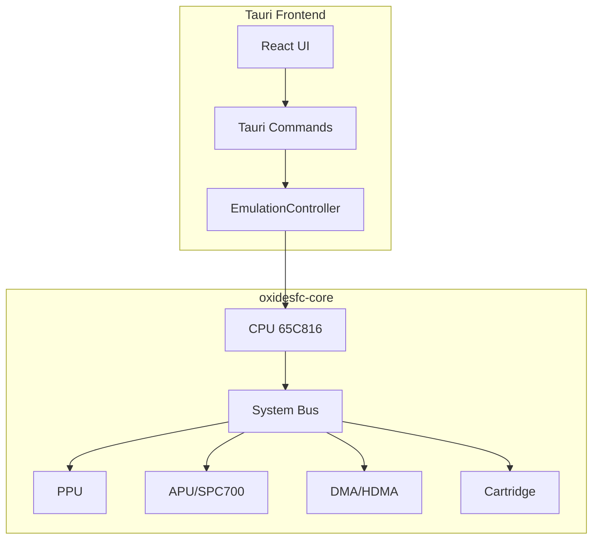

# OxideSFC - Estado de Implementación del Emulador SNES

## Resumen Ejecutivo

El proyecto OxideSFC tiene una arquitectura sólida con los componentes principales estructurados, pero **no es funcional** en su estado actual. Faltan implementaciones críticas para que los juegos puedan ejecutarse.

---

## Arquitectura Actual

---

## Estado por Componente

### 1. CPU (65C816) - ~40% Completado

**Implementado:**
- Estructura básica de registros (A, X, Y, PC, SP, PB, DB, D, P)
- Modos de emulación y flags
- Instrucciones básicas de transferencia (TAX, TXA, TAY, TYA, TSX, TXS)
- Instrucciones de flags (CLC, SEC, CLD, SED, CLI, SEI, CLV)
- Load/Store básicos (LDA, LDX, LDY, STA, STX, STY) con modos immediate, absolute, direct page
- Branches (BCC, BCS, BNE, BEQ, BPL, BMI, BVC, BVS, BRA, BRL)
- Saltos (JMP, JSR, RTS, RTI, JMP indirect)
- Aritméticas básicas (ADC, SBC immediate)
- Lógicas (AND, ORA, EOR, BIT)
- Comparación (CMP, CPX, CPY)
- Increment/Decrement (INX, DEX, INY, DEY, INC, DEC)
- Shift/Rotate (ASL, LSR, ROL, ROR)
- Stack operations (PHA, PLA, PHX, PLX, PHY, PLY, PHP, PLP)
- REP/SEP para manipulación de flags
- XCE para cambio de modo emulación/native

**Falta Implementar:**
- [ ] ~150+ opcodes adicionales del 65C816
- [ ] Modos de direccionamiento faltantes:
  - [ ] Absolute Long (24-bit)
  - [ ] Direct Page Indexed (dp,X), (dp),Y
  - [ ] Stack Relative (sr,S), (sr,S),Y
  - [ ] Block Move (MVN, MVP)
  - [ ] Absolute Indexed Long
- [ ] Instrucciones de bloque (MVN, MVP)
- [ ] Interrupciones (IRQ, NMI, BRK, COP, ABORT)
- [ ] Modo decimal (aritmética BCD)
- [ ] Timing preciso de ciclos
- [ ] Pipelining y cycle stealing

### 2. PPU (Picture Processing Unit) - ~15% Completado

**Implementado:**
- Estructura de VRAM, CGRAM, OAM
- Contadores de scanline y pixel
- Modos NTSC/PAL
- Detección de VBlank y HBlank
- Control de frame ready

**Falta Implementar:**
- [ ] **Renderizado de Backgrounds:**
  - [ ] BG1-BG4 rendering
  - [ ] Modos 0-7 (Mode 7 especialmente complejo)
  - [ ] Tile maps y character data
  - [ ] Scrolling (horizontal, vertical, diagonal)
  - [ ] Mosaic effect
- [ ] **Renderizado de Sprites (OAM):**
  - [ ] Sprite rendering con prioridades
  - [ ] Sprite timing y limits
  - [ ] Objekt time overflow
- [ ] **Efectos especiales:**
  - [ ] Windowing (window 1, window 2)
  - [ ] Color math (addition, subtraction)
  - [ ] Sub-screen backgrounds
  - [ ] Mode 7 rotation/scaling (matrices de transformación)
- [ ] **Output de video:**
  - [ ] Conversión de tiles a pixels
  - [ ] Aplicación de paletas CGRAM
  - [ ] Framebuffer generation
- [ ] **Sincronización:**
  - [ ] Timing preciso con CPU
  - [ ] HDMA triggers

### 3. APU (Audio Processing Unit) - ~30% Completado

**Implementado:**
- SPC700 CPU básico con ~60 opcodes
- Estructura de RAM del APU (64KB)
- Registros PSW (flags)
- Comunicación ports ($2140-$2143)

**Falta Implementar:**
- [ ] **DSP (Digital Signal Processor):**
  - [ ] 8 voice channels
  - [ ] BRR (Bit Rate Reduction) decompression
  - [ ] ADSR envelopes (Attack, Decay, Sustain, Release)
  - [ ] Gaussian interpolation
  - [ ] Echo/reverb effects
  - [ ] Noise generator
  - [ ] Pitch modulation
- [ ] **SPC700 faltante:**
  - [ ] ~50 opcodes adicionales
  - [ ] Instrucciones especiales del SPC700
  - [ ] Timer registers
- [ ] **Audio output:**
  - [ ] Sample buffer generation
  - [ ] 32kHz output rate
  - [ ] Stereo mixing
- [ ] **Boot ROM:**
  - [ ] Implementación del IPL ROM del SPC700

### 4. DMA/HDMA - ~20% Completado

**Implementado:**
- Estructura de 8 canales DMA
- Registros de configuración
- Flags de estado

**Falta Implementar:**
- [ ] **DMA transfers:**
  - [ ] CPU halt durante transfer
  - [ ] Address calculation
  - [ ] Transfer modes (1-byte, 2-byte, 4-byte)
  - [ ] Direction handling (CPU→PPU, PPU→CPU)
- [ ] **HDMA:**
  - [ ] Scanline-based transfers
  - [ ] Indirect addressing
  - [ ] Table processing
  - [ ] Raster effects support
- [ ] **Timing:**
  - [ ] Cycle-accurate DMA timing
  - [ ] HDMA synchronization con PPU

### 5. System Bus - ~50% Completado

**Implementado:**
- Mapeo básico de memoria
- WRAM access
- Cartridge ROM mapping (LoROM, HiROM)
- Open bus behavior

**Falta Implementar:**
- [ ] **I/O Registers completos:**
  - [ ] PPU registers ($2100-$213F)
  - [ ] APU registers ($2140-$217F)
  - [ ] Controller ports ($4016-$4017)
  - [ ] DMA registers ($4300-$437F)
- [ ] **Memory mapping:**
  - [ ] SRAM/Save RAM mapping
  - [ ] Expansion ROM
  - [ ] Mirrors correctos
- [ ] **Controller input:**
  - [ ] Joypad registers
  - [ ] Auto-joypad

### 6. Cartridge - ~40% Completado

**Implementado:**
- Detección LoROM/HiROM
- ROM loading
- Mapeo básico

**Falta Implementar:**
- [ ] **Save RAM:**
  - [ ] SRAM mapping correcto
  - [ ] Persistencia de saves
- [ ] **Special Chips:**
  - [ ] Super FX
  - [ ] SA-1
  - [ ] DSP-1, DSP-2, DSP-3, DSP-4
  - [ ] Cx4
  - [ ] S-DD1
  - [ ] SPC7110
  - [ ] OBC1
  - [ ] ST-001, ST-002, ST-003
- [ ] **Header parsing:**
  - [ ] Validación completa
  - [ ] Detección de coprocessors

### 7. Frontend Integration - ~30% Completado

**Implementado:**
- Tauri commands structure
- EmulationController skeleton
- VideoFrame struct
- InputManager con gilrs
- React UI components

**Falta Implementar:**
- [ ] **EmulationController:**
  - [ ] Conexión real con CPU/PPU/APU
  - [ ] Frame generation loop
  - [ ] Audio sample generation
  - [ ] Save states serialization
- [ ] **Video rendering:**
  - [ ] Canvas/WebGL rendering
  - [ ] Frame scaling options
  - [ ] Shader support
- [ ] **Audio output:**
  - [ ] Web Audio API integration
  - [ ] Audio buffer management
  - [ ] Latency handling
- [ ] **Input handling:**
  - [ ] Keyboard to controller mapping
  - [ ] Gamepad polling integration
  - [ ] Turbo functions

---

## Prioridades de Implementación

### Fase 1: CPU Funcional (Prioridad Crítica)
1. Completar opcodes 65C816 faltantes
2. Implementar todos los modos de direccionamiento
3. Sistema de interrupciones
4. Timing básico

### Fase 2: PPU Básico (Prioridad Crítica)
1. Renderizado de tiles BG
2. Sprite rendering
3. Paletas y colores
4. Framebuffer output

### Fase 3: Integración Mínima (Prioridad Alta)
1. Conectar CPU con PPU via Bus
2. Controller input
3. Frame generation loop
4. Display output en frontend

### Fase 4: Audio (Prioridad Media)
1. DSP implementation
2. BRR decompression
3. Audio output

### Fase 5: Features Avanzados (Prioridad Baja)
1. Mode 7
2. HDMA effects
3. Special chips
4. Save states

---

## Estimación de Completitud General

| Componente | Progreso | Crítico para Funcionar |
|------------|----------|------------------------|
| CPU | 40% | ✅ Sí |
| PPU | 15% | ✅ Sí |
| APU | 30% | ❌ No (audio) |
| DMA | 20% | ⚠️ Parcial |
| Bus | 50% | ✅ Sí |
| Cartridge | 40% | ⚠️ Parcial |
| Frontend | 30% | ✅ Sí |

**Progreso General Estimado: ~35%**

---

## Conclusión

El emulador **no puede ejecutar ningún juego** en su estado actual. Las razones principales son:

1. **CPU incompleta**: Faltan ~150+ opcodes esenciales
2. **PPU sin renderizado**: No genera video output
3. **Integración inexistente**: Los componentes no están conectados
4. **Sin timing**: No hay sincronización entre componentes

Para lograr un emulador funcional que pueda ejecutar juegos simples, se necesita completar al menos:
- CPU al 90%+
- PPU rendering básico al 60%+
- Integración de componentes al 80%+
