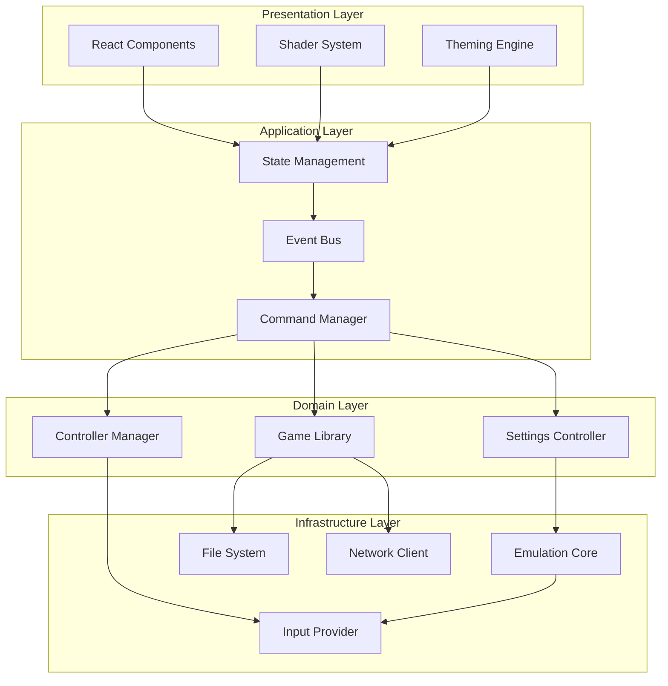
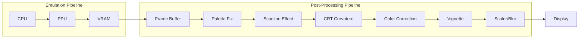
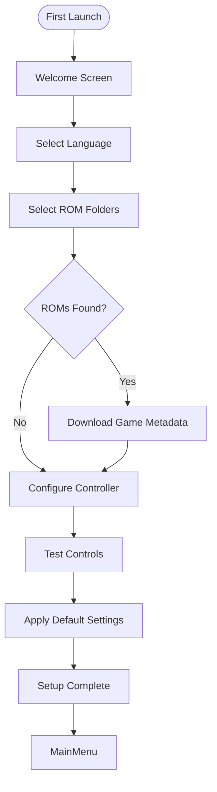
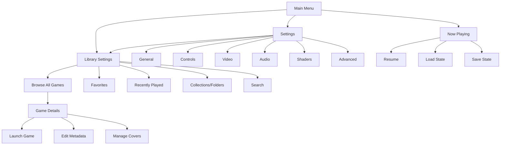
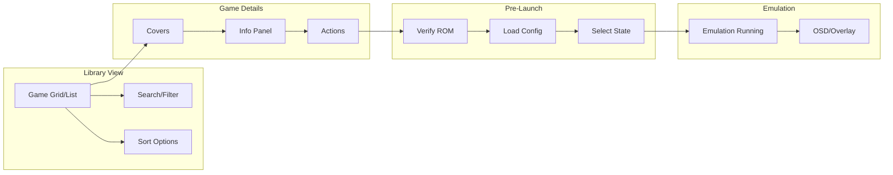
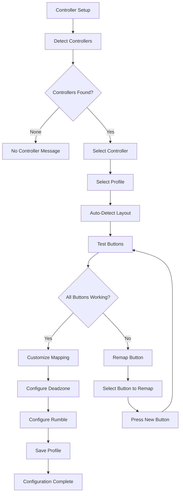

# OxideSFC Frontend Technical Specification

## Document Information

| Property | Value |
|----------|-------|
| Project | OxideSFC Frontend |
| Version | 1.0.0 |
| Status | Technical Specification |
| Created | 2026-03-21 |

---

## Executive Summary

This document provides a comprehensive technical specification for the OxideSFC frontend - the graphical user interface (GUI) for the OxideSFC SNES emulator. The specification covers technology selection, architecture design, implementation strategies, and development timelines necessary to build a production-ready cross-platform emulator frontend.

The existing OxideSFC project already contains a fully implemented emulation core (`oxidesfc-core`) with CPU, PPU, APU, DMA, memory bus, and cartridge handling components. This frontend specification builds upon that foundation to create a complete user-facing application.

---

## 1. Technology Stack Selection

### 1.1 UI Framework Recommendation

#### Primary Recommendation: **Tauri v2**

| Criteria | Assessment |
|----------|------------|
| Performance | Excellent - Rust backend with minimal overhead |
| Binary Size | Excellent - Small footprint (~10-15MB) |
| Security | Excellent - Sandboxed by default |
| Cross-platform | Excellent - Windows, macOS, Linux, Android, iOS |
| Rust Integration | Excellent - Native Rust integration with emulation core |
| WebView Dependency | Required - WebView2 (Windows), WebKit (macOS/Linux) |

**Justification:**

Tauri v2 provides the ideal balance between performance, security, and developer experience for a Rust-based emulator frontend. The existing `oxidesfc-core` crate can be directly integrated as a native Rust dependency, eliminating inter-process communication overhead that Electron would require.

#### Alternative: **iced-rs**

| Criteria | Assessment |
|----------|------------|
| Performance | Excellent - Pure Rust, no WebView |
| Binary Size | Excellent - Minimal dependencies |
| Cross-platform | Good - Missing mobile support |
| Development Speed | Moderate - Less mature ecosystem |

**Use Case:** Consider iced-rs if absolute minimum binary size is critical or if WebView dependencies are unacceptable.

#### Not Recommended: **Electron**

Electron is explicitly NOT recommended due to:
- Large binary size (>150MB vs ~15MB for Tauri)
- Higher memory consumption
- JavaScript/Rust IPC overhead for emulation core communication
- Security concerns with Node.js integration

### 1.2 Rendering Approach

#### Primary Recommendation: **WebGPU with Vulkan/OpenGL/Metal Fallback**

| Rendering Backend | Platform Support | Performance | Complexity |
|-------------------|------------------|-------------|------------|
| WebGPU | Windows 10+, macOS 12+, Linux (emerging) | Excellent | Moderate |
| WebGL 2.0 | All modern platforms | Good | Low |
| Canvas 2D | All platforms | Moderate | Lowest |

**Implementation Strategy:**

```rust
// Rendering backend selection priority
enum RenderBackend {
    WebGPU,    // Primary - best performance
    WebGL2,    // Fallback - broad compatibility
    Canvas2D,  // Final fallback - basic functionality
}
```

**Justification:**

WebGPU provides compute shader capabilities essential for:
- Real-time CRT shader effects
- Advanced upscaling filters (xBRZ, HQx)
- Post-processing pipeline
- GPU-accelerated UI effects

For the frontend UI (non-emulation rendering), CSS/HTML with GPU-accelerated compositing provides sufficient performance while maintaining development velocity.

### 1.3 Technology Stack Summary

| Component | Technology | Version |
|-----------|------------|---------|
| Desktop Framework | Tauri | 2.x |
| Frontend Framework | React + TypeScript | React 18.x |
| Styling | Tailwind CSS | 3.x |
| State Management | Zustand | 4.x |
| Build Tool | Vite | 5.x |
| Rendering (Emulation) | WebGPU/WebGL2 | - |
| Emulation Core | oxidesfc-core | 0.1.x (existing) |

---

## 2. Architecture Design Patterns

### 2.1 Modular Architecture Overview



### 2.2 Separation of Concerns

#### Layer Responsibilities

| Layer | Components | Responsibilities |
|-------|------------|------------------|
| Presentation | React Components, Views, Dialogs | User interaction, rendering UI elements |
| Application | Stores, Services, Commands | Business logic, state coordination |
| Domain | Game, ROM, Settings, Controller | Entity definitions, domain rules |
| Infrastructure | EmulationCore, FileSystem, Network | External system integration |

#### Module Structure

```
oxidesfc-frontend/
├── src/
│   ├── components/          # React UI components
│   │   ├── common/         # Shared UI elements
│   │   ├── library/        # Game library views
│   │   ├── settings/       # Configuration UI
│   │   └── emulator/       # In-emulation overlays
│   ├── hooks/              # Custom React hooks
│   ├── stores/             # Zustand state stores
│   ├── services/           # Business logic services
│   ├── domain/             # Domain entities and types
│   ├── infrastructure/     # External system adapters
│   │   ├── emulation/      # Emulation core interface
│   │   ├── filesystem/     # File system operations
│   │   ├── network/        # API clients
│   │   └── input/          # Input device handling
│   ├── shaders/            # GLSL/WGSL shader code
│   ├── styles/             # CSS and theming
│   └── utils/              # Helper functions
├── src-tauri/              # Tauri Rust backend
│   ├── src/
│   │   ├── main.rs
│   │   ├── commands/       # Tauri command handlers
│   │   └── platform/      # Platform-specific code
│   ├── Cargo.toml
│   └── tauri.conf.json
└── package.json
```

### 2.3 State Management Pattern

**Recommendation: Zustand with Event-Driven Architecture**

```typescript
// Store structure
interface AppState {
  // Emulation state
  emulation: {
    isRunning: boolean;
    currentGame: Game | null;
    frameRate: number;
    videoSettings: VideoSettings;
    audioSettings: AudioSettings;
  };
  
  // Library state
  library: {
    games: Game[];
    folders: Folder[];
    scanningStatus: ScanStatus;
    filters: FilterState;
  };
  
  // Settings state
  settings: {
    general: GeneralSettings;
    controls: ControlSettings;
    shader: ShaderSettings;
    theme: ThemeConfig;
  };
  
  // UI state
  ui: {
    activeView: ViewType;
    modalStack: ModalType[];
    notifications: Notification[];
  };
}
```

### 2.4 Event-Driven Communication

```typescript
// Event bus for inter-component communication
interface EventBus {
  // Emulation events
  emit(event: 'emulation:start', game: Game): void;
  emit(event: 'emulation:pause'): void;
  emit(event: 'emulation:resume'): void;
  emit(event: 'emulation:stop'): void;
  emit(event: 'emulation:frame', frame: VideoFrame): void;
  
  // Library events
  emit(event: 'library:scan:start'): void;
  emit(event: 'library:scan:progress', progress: number): void;
  emit(event: 'library:scan:complete', games: Game[]): void;
  
  // Settings events
  emit(event: 'settings:change', key: string, value: unknown): void;
  
  // Input events
  emit(event: 'input:button', button: InputButton): void;
  
  // Subscribe to events
  on<T>(event: string, handler: (data: T) => void): () => void;
}
```

### 2.5 Thread-Safe Emulation Core Communication

The emulation core runs in a dedicated thread with the following interface:

```rust
// Tauri command interface to emulation core
#[tauri::command]
pub fn load_rom(path: String) -> Result<GameInfo, String>;

#[tauri::command]
pub fn start_emulation(game_id: String) -> Result<(), String>;

#[tauri::command]
pub fn pause_emulation() -> Result<(), String>;

#[tauri::command]
pub fn resume_emulation() -> Result<(), String>;

#[tauri::command]
pub fn stop_emulation() -> Result<(), String>;

#[tauri::command]
pub fn get_video_frame() -> VideoFrame;

#[tauri::command]
pub fn set_input_state(buttons: InputState);

#[tauri::command]
pub fn get_audio_samples(count: usize) -> Vec<i16>;

#[tauri::command]
pub fn set_video_settings(settings: VideoSettings);

#[tauri::command]
pub fn set_audio_settings(settings: AudioSettings);

#[tauri::command]
pub fn save_state(slot: u8) -> Result<(), String>;

#[tauri::command]
pub fn load_state(slot: u8) -> Result<(), String>;
```

---

## 3. Core Features Implementation

### 3.1 Game Library Management

#### Database Schema Design

```sql
-- Games table
CREATE TABLE games (
    id TEXT PRIMARY KEY,
    file_path TEXT NOT NULL UNIQUE,
    file_name TEXT NOT NULL,
    file_size INTEGER NOT NULL,
    crc32 TEXT,
    md5 TEXT,
    sha256 TEXT,
    
    -- ROM information
    rom_type TEXT,           -- LoROM, HiROM, ExHiROM
    rom_size INTEGER,        -- ROM size in bytes
    sram_size INTEGER,       -- Save RAM size
    country TEXT,           -- USA, Europe, Japan, etc.
    
    -- Metadata (populated from external sources)
    title TEXT,
    alternate_titles TEXT[],
    description TEXT,
    release_date TEXT,
    developer TEXT,
    publisher TEXT,
    genre TEXT,
    players INTEGER DEFAULT 1,
    rating REAL,
    
    -- Frontend-specific
    play_count INTEGER DEFAULT 0,
    last_played TEXT,
    favorite BOOLEAN DEFAULT FALSE,
    custom_cover_path TEXT,
    
    -- Status
    is_valid BOOLEAN DEFAULT TRUE,
    validation_errors TEXT[],
    
    created_at TEXT NOT NULL,
    updated_at TEXT NOT NULL
);

-- Folders/Collections
CREATE TABLE folders (
    id TEXT PRIMARY KEY,
    name TEXT NOT NULL,
    parent_id TEXT REFERENCES folders(id),
    created_at TEXT NOT NULL
);

-- Game-Folder relationship
CREATE TABLE game_folders (
    game_id TEXT REFERENCES games(id) ON DELETE CASCADE,
    folder_id TEXT REFERENCES folders(id) ON DELETE CASCADE,
    PRIMARY KEY (game_id, folder_id)
);

-- Settings
CREATE TABLE settings (
    key TEXT PRIMARY KEY,
    value TEXT NOT NULL,
    updated_at TEXT NOT NULL
);

-- Controller profiles
CREATE TABLE controller_profiles (
    id TEXT PRIMARY KEY,
    name TEXT NOT NULL,
    is_default BOOLEAN DEFAULT FALSE,
    config TEXT NOT NULL,  -- JSON blob
    created_at TEXT NOT NULL
);
```

#### ROM Scanning Algorithms

```typescript
// ROM file extensions to scan
const ROM_EXTENSIONS = ['.sfc', '.smc', '.fig', '.swc', '.zip', '.7z', '.rar'];

// Scanning configuration
interface ScanConfig {
  directories: string[];
  recursive: boolean;
  skipHidden: boolean;
  extensions: string[];
  verifyHashes: boolean;
  extractArchives: boolean;
}

// ROM detection logic
function detectRomFormat(buffer: ArrayBuffer): RomFormat {
  const header = new Uint8Array(buffer, 0, 64);
  
  // Check for SMC header (64-byte header)
  if (header[0] === 0x00 && header[1] === 0x00 && 
      header[2] === 0x00 && header[3] === 0x00) {
    return RomFormat.SMC;
  }
  
  // Check for FIG format
  if (header[0] === 0x44 && header[1] === 0x53 && 
      header[2] === 0x4D && header[3] === 0x31) {
    return RomFormat.FIG;
  }
  
  // Check for SWC format
  if (header[0] === 0xDE && header[1] === 0xC1 && 
      header[2] === 0xDE && header[3] === 0x00) {
    return RomFormat.SWC;
  }
  
  return RomFormat.BARE;
}

// ROM region detection
function detectRomRegion(header: Uint8Array): RomRegion {
  // Check ROM type at offset 0xFFD5
  const romType = header[0xFFD5 - 0x200];
  
  switch (romType) {
    case 0x20: return RomRegion.DOMESTIC;  // Japanese
    case 0x21: return RomRegion.EXPORT;   // Overseas
    case 0x30: return RomRegion.DOMESTIC;
    case 0x31: return RomRegion.EXPORT;
    default: return RomRegion.UNKNOWN;
  }
}

// Memory mapping detection (LoROM, HiROM, ExHiROM)
function detectMemoryMapping(header: Uint8Array, fileSize: number): MemoryMapping {
  const resetVector = (header[0x3C] << 8) | header[0x3D];
  
  // ExHiROM detection (for 4MB+ ROMs)
  if (fileSize >= 4 * 1024 * 1024) {
    if (resetVector >= 0x8000 && resetVector < 0xC000) {
      return MemoryMapping.EXHIROM;
    }
  }
  
  // HiROM detection
  if (resetVector >= 0x8000 && resetVector < 0xC000) {
    // Check ROM title in HiROM position
    const titleHi = String.fromCharCode(...header.slice(0xFFC0, 0xFFD0));
    if (titleHi.trim().length > 0) {
      return MemoryMapping.HIROM;
    }
  }
  
  return MemoryMapping.LOROM;
}
```

### 3.2 Metadata Retrieval

#### Supported Metadata Sources

| Source | API Type | Data Quality | Rate Limits |
|--------|----------|--------------|-------------|
| Screenscraper.fr | REST | Excellent | Strict (requires account) |
| IGDB | REST | Good | Commercial tier required |
| OpenVGDB | Local DB | Good | Unlimited |
| Custom JSON | Local | User-defined | Unlimited |

#### Metadata Lookup Strategy

```typescript
interface MetadataLookupOptions {
  preferredSource: 'screenscraper' | 'igdb' | 'local';
  fallbackSources: string[];
  includeCovers: boolean;
  coverResolution: 'thumbnail' | 'small' | 'medium' | 'large' | 'original';
}

// Lookup priority:
// 1. Local cache (SQLite database)
// 2. Screenscraper.fr (most comprehensive SNES data)
// 3. IGDB (good for popular titles)
// 4. OpenVGDB (fallback for accurate ROM info)
async function lookupMetadata(rom: RomInfo, options: MetadataLookupOptions): Promise<GameMetadata> {
  // 1. Check local cache first
  const cached = await localDb.findByHash(rom.sha256);
  if (cached && !options.forceRefresh) {
    return cached;
  }
  
  // 2. Query preferred source
  const metadata = await queryExternalSource(rom, options.preferredSource);
  
  // 3. Cache result locally
  await localDb.save(metadata);
  
  return metadata;
}
```

### 3.3 ROM Region and Header Parsing

```rust
// Rust implementation for ROM header parsing
pub struct RomHeader {
    pub title: String,
    pub mapping: MemoryMapping,
    pub rom_type: RomType,
    pub rom_size: u32,
    pub sram_size: u32,
    pub region: Region,
    pub destination_code: u8,
    pub version: u8,
}

#[derive(Debug, Clone, Copy)]
pub enum MemoryMapping {
    LoRom,
    HiRom,
    ExHiRom,
    Unknown,
}

pub fn parse_rom_header(data: &[u8], file_size: u32) -> RomHeader {
    // Check for ExHiROM (offset 0xFFC0)
    if file_size >= 4 * 1024 * 1024 {
        let header_ex = &data[0xFFC0..0xFFE0];
        if is_valid_header(header_ex) {
            return parse_header(header_ex, MemoryMapping::ExHiRom);
        }
    }
    
    // Check HiROM (offset 0xFFC0)
    let header_hi = &data[0xFFC0..0xFFE0];
    if is_valid_header(header_hi) {
        return parse_header(header_hi, MemoryMapping::HiRom);
    }
    
    // Check LoROM (offset 0x7FC0)
    let header_lo = &data[0x7FC0..0x7FE0];
    if is_valid_header(header_lo) {
        return parse_header(header_lo, MemoryMapping::LoRom);
    }
    
    // Check for SMC header (64-byte header)
    if data.len() > 64 && data[0..4].iter().all(|&b| b == 0) {
        return parse_rom_header(&data[64..], file_size - 64);
    }
    
    RomHeader::default()
}

fn is_valid_header(header: &[u8]) -> bool {
    // Title should contain valid ASCII characters
    !header.iter().take(21).all(|&b| b == 0x20 || b == 0x00)
}
```

---

## 4. Controller Input Handling

### 4.1 Gamepad API Integration

#### Primary Recommendation: ** gilrs + Tauri Commands**

| API | Platform Support | Latency | Features |
|-----|------------------|---------|----------|
| gilrs | Linux, Windows, macOS | Low | Excellent |
| SDL2 | All platforms | Low | Excellent (but C library) |
| Windows Game Input | Windows 11+ | Very Low | Good |
| Browser Gamepad API | All (Web) | Moderate | Limited |

**Implementation Architecture:**

```rust
// Rust-side input handling with gilrs
use gilrs::{Gilrs, Event, EventType};

pub struct InputManager {
    gilrs: Gilrs,
    connected_controllers: HashMap<GamepadId, ControllerState>,
    keyboard_state: KeyboardState,
}

impl InputManager {
    pub fn new() -> Result<Self> {
        Ok(Self {
            gilrs: Gilrs::new()?,
            connected_controllers: HashMap::new(),
            keyboard_state: KeyboardState::new(),
        })
    }
    
    pub fn poll_events(&mut self) -> Vec<InputEvent> {
        let mut events = Vec::new();
        
        while let Some(event) = self.gilrs.next_event() {
            match event.event {
                EventType::ButtonPressed(button, _) => {
                    events.push(InputEvent::ButtonPress(button_to_snes(button)));
                }
                EventType::ButtonReleased(button, _) => {
                    events.push(InputEvent::ButtonRelease(button_to_snes(button)));
                }
                EventType::AxisChanged(axis, value, _) => {
                    events.push(InputEvent::AxisMove(axis_to_snes(axis), value));
                }
                EventType::Connected(_) => {
                    events.push(InputEvent::ControllerConnected(event.id));
                }
                EventType::Disconnected => {
                    events.push(InputEvent::ControllerDisconnected(event.id));
                }
                _ => {}
            }
        }
        
        events
    }
}
```

### 4.2 Keyboard Mapping System

```typescript
// Default keyboard mappings
const DEFAULT_KEYBOARD_MAPPING: KeyMapping = {
  // D-pad
  ArrowUp: SnesButton.Up,
  ArrowDown: SnesButton.Down,
  ArrowLeft: SnesButton.Left,
  ArrowRight: SnesButton.Right,
  
  // Face buttons
  KeyZ: SnesButton.A,
  KeyX: SnesButton.B,
  Enter: SnesButton.Start,
  ShiftRight: SnesButton.Select,
  
  // Shoulder buttons
  KeyA: SnesButton.L,
  KeyS: SnesButton.R,
};

// Allow user remapping
interface KeyMappingConfig {
  [keyCode: string]: SnesButton | HotkeyAction;
}

// Hotkey actions (global, works even when not in focus)
const HOTKEY_ACTIONS = {
  TogglePause: 'toggle_pause',
  StopEmulation: 'stop_emulation',
  SaveState: 'save_state',
  LoadState: 'load_state',
  QuickSave: 'quick_save',
  QuickLoad: 'quick_load',
  Screenshot: 'screenshot',
  ToggleFullscreen: 'toggle_fullscreen',
  OpenMenu: 'open_menu',
  FastForward: 'fast_forward',
} as const;
```

### 4.3 Multiple Controller Profile Support

```typescript
interface ControllerProfile {
  id: string;
  name: string;
  isDefault: boolean;
  type: 'auto' | 'generic' | 'specific';
  
  // Button mappings
  buttons: {
    a: InputSource;
    b: InputSource;
    x: InputSource;
    y: InputSource;
    l: InputSource;
    r: InputSource;
    start: InputSource;
    select: InputSource;
    up: InputSource;
    down: InputSource;
    left: InputSource;
    right: InputSource;
  };
  
  // Analog stick configuration
  analog: {
    leftX: InputSource;
    leftY: InputSource;
    rightX: InputSource;
    rightY: InputSource;
    deadzone: number;
    sensitivity: number;
  };
  
  // Rumble configuration
  rumble: {
    enabled: boolean;
    strength: number;
  };
}

interface InputSource {
  type: 'keyboard' | 'button' | 'axis' | 'hat';
  value: string | number;
  invert: boolean;
}
```

---

## 5. Shader and Visual Enhancement Options

### 5.1 CRT Shader Implementations

```glsl
// Example: Scanline effect fragment shader
precision highp float;

uniform sampler2D uTexture;
uniform vec2 uResolution;
uniform float uTime;

// CRT parameters
uniform float scanlineIntensity;
uniform float scanlineCount;
uniform float curvature;
uniform float vignetteStrength;
uniform float phosphorGlow;
uniform vec3 rgbOffset;

void main() {
    vec2 uv = gl_FragCoord.xy / uResolution;
    
    // Apply CRT curvature
    vec2 curved = uv * 2.0 - 1.0;
    curved *= 1.0 + pow(length(curved), 2.0) * curvature;
    curved = curved * 0.5 + 0.5;
    
    // Check bounds after curvature
    if (curved.x < 0.0 || curved.x > 1.0 || curved.y < 0.0 || curved.y > 1.0) {
        gl_FragColor = vec4(0.0, 0.0, 0.0, 1.0);
        return;
    }
    
    // RGB separation (chromatic aberration)
    float r = texture2D(uTexture, curved + rgbOffset.xy).r;
    float g = texture2D(uTexture, curved).g;
    float b = texture2D(uTexture, curved - rgbOffset.xy).b;
    vec3 color = vec3(r, g, b);
    
    // Scanlines
    float scanline = sin(curved.y * scanlineCount * 3.14159) * 0.5 + 0.5;
    color *= 1.0 - scanlineIntensity * (1.0 - scanline);
    
    // Phosphor glow (adds color bleeding)
    color += color * phosphorGlow * vec3(0.1, 0.1, 0.15);
    
    // Vignette
    float vignette = 1.0 - pow(length(curved - 0.5) * 1.4, 2.0) * vignetteStrength;
    color *= vignette;
    
    gl_FragColor = vec4(color, 1.0);
}
```

### 5.2 Resolution Scaling Filters

| Filter | Quality | Performance | Description |
|--------|---------|-------------|-------------|
| Nearest | Low | Excellent | Basic pixel doubling |
| Bilinear | Medium | Excellent | Smooth interpolation |
| xBRZ | High | Moderate | Edge-aware upscaling |
| HQx | High | Moderate | Smooth edge preservation |
| CRT | N/A | Varies | Authentic CRT appearance |

### 5.3 Color Palette Enhancement

```rust
// Palette enhancement modes
pub enum ColorPaletteMode {
    /// Use raw PPU color output (no enhancement)
    Direct,
    /// Apply gamma correction
    GammaCorrected(f32),
    /// Use custom palette
    CustomPalette(Vec<RgbColor>),
    /// Apply color temperature shift
    ColorTemperature(i32),  // -100 to +100
    /// Apply color saturation boost
    Saturated(f32),         // 0.0 to 2.0
    /// Authentic NES/SNES colors (PPU-specific)
    PpuAccurate,
}

pub fn apply_palette_enhancement(
    mode: &ColorPaletteMode,
    frame_buffer: &mut [u8; 256 * 240 * 4],
) {
    match mode {
        ColorPaletteMode::GammaCorrected(gamma) => {
            for pixel in frame_buffer.chunks_exact_mut(4) {
                let r = pixel[0] as f32 / 255.0;
                let g = pixel[1] as f32 / 255.0;
                let b = pixel[2] as f32 / 255.0;
                pixel[0] = (r.powf(*gamma) * 255.0) as u8;
                pixel[1] = (g.powf(*gamma) * 255.0) as u8;
                pixel[2] = (b.powf(*gamma) * 255.0) as u8;
            }
        }
        // ... other modes
        _ => {}
    }
}
```

### 5.4 Post-Processing Pipeline



---

## 6. Performance Optimization

### 6.1 Rendering Pipeline Optimization

#### Triple Buffering Implementation

```rust
pub struct RenderPipeline {
    front_buffer: FrameBuffer,
    back_buffer: FrameBuffer,
    render_buffer: FrameBuffer,
    vsync_enabled: bool,
}

impl RenderPipeline {
    pub fn swap_buffers(&mut self) {
        // Triple buffering: rotate through buffers
        std::mem::swap(&mut self.front_buffer, &mut self.back_buffer);
        std::mem::swap(&mut self.back_buffer, &mut self.render_buffer);
    }
    
    pub fn render(&mut self, ppu: &Ppu) {
        // Render to back buffer
        ppu.render_frame(&mut self.render_buffer);
        
        // Apply shaders
        self.apply_post_processing(&mut self.render_buffer);
        
        // Swap to front for display
        self.swap_buffers();
    }
}
```

#### VSync Configuration

```typescript
interface VideoSettings {
  vsync: boolean;
  tripleBuffering: boolean;
  frameLimit: 'unlimited' | '60' | '120' | '144' | 'custom';
  customFrameLimit: number;
  
  // For integrated GPUs
  reducedLatency: boolean;
}

// Recommended settings by use case
const VIDEO_PRESETS = {
  quality: {
    vsync: true,
    tripleBuffering: true,
    frameLimit: '60',
  },
  performance: {
    vsync: false,
    tripleBuffering: false,
    frameLimit: 'unlimited',
  },
  lowLatency: {
    vsync: false,
    tripleBuffering: false,
    frameLimit: 'unlimited',
    reducedLatency: true,
  },
};
```

### 6.2 Memory Management Strategies

#### Arena Allocators

```rust
use bumpalo::Bump;

// Per-frame arena for temporary allocations
pub struct FrameAllocator {
    arena: Bump,
}

impl FrameAllocator {
    pub fn new(capacity: usize) -> Self {
        Self {
            arena: Bump::with_capacity(capacity),
        }
    }
    
    pub fn reset(&mut self) {
        self.arena.reset();
    }
    
    pub fn alloc<T>(&self, value: T) -> &mut T {
        self.arena.alloc(value)
    }
}

// Object pooling for frequently created/destroyed objects
pub struct ObjectPool<T> {
    available: Vec<T>,
    in_use: Vec<T>,
    factory: Box<dyn Fn() -> T>,
}

impl<T: Default> ObjectPool<T> {
    pub fn with_default(capacity: usize) -> Self {
        let available: Vec<T> = (0..capacity).map(|_| T::default()).collect();
        Self {
            available,
            in_use: Vec::new(),
            factory: Box::new(|| T::default()),
        }
    }
    
    pub fn acquire(&mut self) -> T {
        self.available.pop().unwrap_or_else(|| (self.factory)())
    }
    
    pub fn release(&mut self, obj: T) {
        self.in_use.retain(|x| !std::ptr::eq(x, &obj));
        self.available.push(obj);
    }
}
```

### 6.3 Async I/O for ROM Loading

```rust
use tokio::fs::File;
use tokio::io::AsyncReadExt;

// Async ROM loading with progress
pub async fn load_rom_async(path: &Path) -> Result<RomData, RomLoadError> {
    let mut file = File::open(path).await?;
    let metadata = file.metadata().await?;
    let file_size = metadata.len();
    
    let mut buffer = Vec::with_capacity(file_size as usize);
    let mut loaded: u64 = 0;
    
    // Read in chunks for progress tracking
    let chunk_size = 64 * 1024; // 64KB chunks
    let mut chunk = vec![0u8; chunk_size];
    
    while let Ok(n) = file.read(&mut chunk).await {
        if n == 0 { break; }
        buffer.extend_from_slice(&chunk[..n]);
        loaded += n as u64;
        
        // Emit progress event
        let progress = (loaded as f64 / file_size as f64) * 100.0;
        emit(ProgressEvent::RomLoad(progress));
    }
    
    Ok(RomData::new(buffer, file_size))
}

// ZIP/7z extraction
pub async fn extract_rom_from_archive(path: &Path) -> Result<Vec<u8>, RomLoadError> {
    let file = File::open(path).await?;
    let mut archive = zip::ZipArchive::new(file).await?;
    
    // Find first valid ROM file in archive
    for i in 0..archive.len() {
        let mut file = archive.by_index(i)?;
        if is_rom_extension(file.name()) {
            let mut contents = Vec::new();
            file.read_to_end(&mut contents).await?;
            return Ok(contents);
        }
    }
    
    Err(RomLoadError::NoRomInArchive)
}
```

### 6.4 UI Responsiveness During Emulation

```typescript
// Web Workers for non-blocking UI operations
const workerCode = `
  self.onmessage = async (e) => {
    const { type, payload } = e.data;
    
    switch (type) {
      case 'scan_directory':
        const games = await scanDirectory(payload.path);
        self.postMessage({ type: 'scan_complete', games });
        break;
        
      case 'fetch_metadata':
        const metadata = await fetchGameMetadata(payload.gameId);
        self.postMessage({ type: 'metadata', metadata });
        break;
        
      case 'hash_rom':
        const hash = await computeRomHash(payload.path);
        self.postMessage({ type: 'hash', hash });
        break;
    }
  };
`;

// Usage in main thread
const worker = new Worker(URL.createObjectURL(new Blob([workerCode])));
worker.onmessage = (e) => {
  if (e.data.type === 'scan_complete') {
    updateLibrary(e.data.games);
  }
};
```

---

## 7. Theming and Customization System

### 7.1 CSS-Like Theming Approach

```typescript
// Theme definition (CSS custom properties compatible)
interface Theme {
  name: string;
  isDark: boolean;
  
  // Colors
  colors: {
    primary: string;
    secondary: string;
    accent: string;
    background: string;
    surface: string;
    error: string;
    warning: string;
    success: string;
    text: {
      primary: string;
      secondary: string;
      disabled: string;
      inverse: string;
    };
  };
  
  // Typography
  typography: {
    fontFamily: string;
    fontFamilyMono: string;
    fontSize: {
      xs: string;
      sm: string;
      md: string;
      lg: string;
      xl: string;
    };
  };
  
  // Spacing
  spacing: {
    xs: string;
    sm: string;
    md: string;
    lg: string;
    xl: string;
  };
  
  // Borders
  borderRadius: {
    sm: string;
    md: string;
    lg: string;
    full: string;
  };
  
  // Effects
  shadows: {
    sm: string;
    md: string;
    lg: string;
  };
  
  // Animations
  transitions: {
    fast: string;
    normal: string;
    slow: string;
  };
}

// Apply theme to document
function applyTheme(theme: Theme) {
  const root = document.documentElement;
  
  // Set CSS custom properties
  root.style.setProperty('--color-primary', theme.colors.primary);
  root.style.setProperty('--color-secondary', theme.colors.secondary);
  // ... etc
}
```

### 7.2 Default Theme Presets

```typescript
const THEMES = {
  // Dark theme (default)
  dark: {
    name: 'Dark',
    isDark: true,
    colors: {
      primary: '#6366f1',
      secondary: '#8b5cf6',
      accent: '#06b6d4',
      background: '#0f172a',
      surface: '#1e293b',
      error: '#ef4444',
      warning: '#f59e0b',
      success: '#22c55e',
      text: {
        primary: '#f8fafc',
        secondary: '#94a3b8',
        disabled: '#475569',
        inverse: '#0f172a',
      },
    },
  },
  
  // Light theme
  light: {
    name: 'Light',
    isDark: false,
    colors: {
      primary: '#4f46e5',
      secondary: '#7c3aed',
      accent: '#0891b2',
      background: '#f8fafc',
      surface: '#ffffff',
      error: '#dc2626',
      warning: '#d97706',
      success: '#16a34a',
      text: {
        primary: '#0f172a',
        secondary: '#64748b',
        disabled: '#cbd5e1',
        inverse: '#f8fafc',
      },
    },
  },
  
  // CRT-style theme
  retro: {
    name: 'Retro CRT',
    isDark: true,
    colors: {
      primary: '#00ff41',
      secondary: '#00cc33',
      accent: '#ffb000',
      background: '#001100',
      surface: '#002200',
      error: '#ff3333',
      warning: '#ffcc00',
      success: '#00ff00',
      text: {
        primary: '#00ff41',
        secondary: '#00aa2a',
        disabled: '#005500',
        inverse: '#001100',
      },
    },
  },
};
```

### 7.3 Font and Icon System

```typescript
// Icon system using a font icon library
const ICONS = {
  // Navigation
  home: 'icon-home',
  library: 'icon-library',
  settings: 'icon-settings',
  emulator: 'icon-gamepad',
  
  // Actions
  play: 'icon-play',
  pause: 'icon-pause',
  stop: 'icon-stop',
  save: 'icon-save',
  load: 'icon-folder-open',
  
  // Media
  cover: 'icon-image',
  screenshot: 'icon-camera',
  
  // Controls
  keyboard: 'icon-keyboard',
  gamepad: 'icon-gamepad-alt',
} as const;

// Font recommendations
const FONTS = {
  ui: {
    primary: 'Inter, system-ui, sans-serif',
    mono: 'JetBrains Mono, Consolas, monospace',
  },
  // For retro aesthetic
  retro: {
    pixel: 'Press Start 2P, VT323, monospace',
  },
};
```

---

## 8. Cross-Platform Compatibility

### 8.1 Windows-Specific Considerations

| Aspect | Implementation |
|--------|---------------|
| WebView2 | Include WebView2 Evergreen bootstrapper or use System WebView2 |
| DirectX Fallback | Implement D3D11 backend for WebGPU unavailable |
| AppData | Store config in `%APPDATA%\OxideSFC` |
| Registry | Associate .sfc, .smc file extensions |
| High DPI | Enable per-monitor DPI awareness |
| Game Input API | Use Windows.Gaming.Input for low-latency gamepad |

```rust
// Windows-specific initialization
#[cfg(target_os = "windows")]
pub fn init_platform() -> PlatformConfig {
    PlatformConfig {
        data_dir: dirs::data_dir()
            .unwrap_or_else(|| PathBuf::from("."))
            .join("OxideSFC"),
        
        // Use Windows Game Input when available
        input_api: InputApi::WindowsGameInput,
        
        // Enable D3D11 fallback
        render_fallbacks: vec![RenderBackend::D3D11],
        
        // File associations
        extensions: vec![".sfc", ".smc", ".fig", ".swc"],
    }
}
```

### 8.2 macOS Considerations

| Aspect | Implementation |
|--------|---------------|
| WebView | Use WKWebView (WebKit) - always available |
| Metal | Use Metal for GPU rendering fallback |
| App Store | Prepare for Mac App Store distribution |
| Notarization | Sign and notarize for distribution |
| Universal Binaries | Build for arm64 and x86_64 |

```rust
#[cfg(target_os = "macos")]
pub fn init_platform() -> PlatformConfig {
    PlatformConfig {
        data_dir: dirs::data_dir()
            .unwrap_or_else(|| PathBuf::from("."))
            .join("OxideSFC"),
        
        input_api: InputApi::IOKit,
        
        render_fallbacks: vec![RenderBackend::Metal],
        
        extensions: vec![".sfc", ".smc", ".fig", ".swc"],
    }
}
```

### 8.3 Linux Considerations

| Aspect | Implementation |
|--------|---------------|
| Display Server | Support both X11 and Wayland |
| System Themes | Respect GTK/Qt theme settings |
| Flatpak | Prepare Flatpak manifest |
| AppImage | Single-file distribution |
| Gamepad | Use evdev via gilrs |

```rust
#[cfg(target_os = "linux")]
pub fn init_platform() -> PlatformConfig {
    PlatformConfig {
        data_dir: dirs::config_dir()
            .unwrap_or_else(|| PathBuf::from("."))
            .join("oxidesfc"),
        
        input_api: InputApi::Gilrs,
        
        render_fallbacks: vec![RenderBackend::OpenGL],
        
        extensions: vec![".sfc", ".smc", ".fig", ".swc"],
    }
}
```

### 8.4 Cross-Platform File Path Handling

```typescript
// Abstraction for platform-specific paths
const PATHS = {
  // Configuration directory
  config: () => {
    switch (platform) {
      case 'win32': return process.env.APPDATA + '/OxideSFC';
      case 'darwin': return process.env.HOME + '/Library/Application Support/OxideSFC';
      case 'linux': return process.env.XDG_CONFIG_HOME || process.env.HOME + '/.config/oxidesfc';
    }
  },
  
  // Save states directory
  saves: () => {
    switch (platform) {
      case 'win32': return PATHS.config() + '/saves';
      case 'darwin': return PATHS.config() + '/Saves';
      case 'linux': return PATHS.config() + '/saves';
    }
  },
  
  // Screenshots directory
  screenshots: () => {
    switch (platform) {
      case 'win32': return process.env.USERPROFILE + '/Pictures/OxideSFC';
      case 'darwin': return process.env.HOME + '/Pictures/OxideSFC';
      case 'linux': return process.env.HOME + '/Pictures/OxideSFC';
    }
  },
};
```

---

## 9. User Experience Flow Diagrams

### 9.1 First-Time Setup Wizard Flow



### 9.2 Main Navigation Structure



### 9.3 Game Selection and Launch Flow



### 9.4 Settings Configuration Flow

```mermaid
flowchart TD
    Settings[Settings Hub] --> Video[Video Settings]
    Settings --> Audio[Audio Settings]
    Settings --> Controls[Control Settings]
    Settings --> Library[Library Settings]
    
    Video --> Display[Display Mode]
    Video --> Renderer[Renderer]
    Video --> Resolution[Internal Resolution]
    Video --> Shader[Shader Selection]
    
    Audio --> Output[Output Device]
    Audio --> Latency[Latency]
    Audio --> Volume[Volume]
    Audio --> Ducking[Audio Ducking]
    
    Controls --> Keyboard[Keyboard Mapping]
    Controls --> Gamepad[Gamepad Configuration]
    Controls --> Hotkeys[Global Hotkeys]
    Controls --> Profiles[Controller Profiles]
    
    Library --> Folders[ROM Folders]
    Library --> Metadata[Metadata Sources]
    Library --> Scanning[Scanning Options]
    Library --> Display[Display Options]
```



### 9.5 Controller Configuration Flow



---

## 10. Testing Methodology and Debugging Tools

### 10.1 Unit Testing Framework

| Framework | Language | Features |
|-----------|----------|----------|
| Rust (core) | `#[cfg(test)]` + `cargo test` | Built-in, no dependencies |
| Frontend | Vitest | Fast, Vite integration |
| Integration | Playwright | E2E browser testing |

```typescript
// Example: React component test with Vitest
import { render, screen, fireEvent } from '@testing-library/react';
import { GameCard } from './GameCard';

describe('GameCard', () => {
  const mockGame: Game = {
    id: '1',
    title: 'Super Mario World',
    filePath: '/roms/smw.sfc',
    coverPath: '/covers/smw.png',
  };
  
  it('displays game title', () => {
    render(<GameCard game={mockGame} />);
    expect(screen.getByText('Super Mario World')).toBeInTheDocument();
  });
  
  it('calls onPlay when play button clicked', () => {
    const onPlay = vi.fn();
    render(<GameCard game={mockGame} onPlay={onPlay} />);
    
    fireEvent.click(screen.getByRole('button', { name: /play/i }));
    expect(onPlay).toHaveBeenCalledWith(mockGame);
  });
});
```

### 10.2 Integration Testing Strategies

```typescript
// Tauri integration tests
describe('Emulation Integration', () => {
  it('loads a valid ROM file', async () => {
    const romPath = testFixtures.validRom;
    const result = await invoke<GameInfo>('load_rom', { path: romPath });
    
    expect(result.isValid).toBe(true);
    expect(result.title).toBeDefined();
  });
  
  it('starts and stops emulation', async () => {
    await invoke('load_rom', { path: testFixtures.validRom });
    await invoke('start_emulation');
    
    const isRunning = await invoke<boolean>('is_emulation_running');
    expect(isRunning).toBe(true);
    
    await invoke('stop_emulation');
    
    const isRunningAfter = await invoke<boolean>('is_emulation_running');
    expect(isRunningAfter).toBe(false);
  });
  
  it('saves and loads state', async () => {
    await invoke('start_emulation');
    
    // Advance a few frames
    await wait(100);
    
    await invoke('save_state', { slot: 0 });
    await invoke('stop_emulation');
    
    // Reload and verify
    await invoke('load_state', { slot: 0 });
    await invoke('start_emulation');
    
    // State should be restored
    expect(await invoke('get_state_slot')).toBe(0);
  });
});
```

### 10.3 Performance Profiling Tools

| Tool | Purpose | Platform |
|------|---------|----------|
| `perf` | Linux CPU profiling | Linux |
| Instruments | macOS profiling | macOS |
| RenderDoc | GPU frame debugging | Windows/Linux |
| web-prf | Browser profiling | All |
| Rust `flamegraph` | Rust code profiling | All |

```bash
# Rust CPU profiling
cargo install cargo-flamegraph
cargo flamegraph --bin oxidesfc

# Memory profiling
cargo install cargo-mem-profiler
cargo mem-profiler --bin oxidesfc

# Frontend profiling
# Chrome DevTools > Performance tab
```

### 10.4 Debug Logging and Crash Reporting

```rust
// Structured logging with tracing
use tracing::{info, warn, error, debug};
use tracing_subscriber::{fmt, prelude::*, EnvFilter};

pub fn init_logging() {
    let filter = EnvFilter::try_from_default_env()
        .unwrap_or_else(|_| EnvFilter::new("info,oxidesfc=debug"));
    
    tracing_subscriber::registry()
        .with(fmt::layer().with_target(true))
        .with(filter)
        .init();
}

// Crash handler
use std::panic;

pub fn init_panic_handler() {
    panic::set_hook(Box::new(|panic_info| {
        let location = panic_info.location()
            .map(|l| format!("{}:{}:{}", l.file(), l.line(), l.column()))
            .unwrap_or_else(|| "unknown".to_string());
        
        let message = if let Some(s) = panic_info.payload().downcast_ref::<&str>() {
            s.to_string()
        } else if let Some(s) = panic_info.payload().downcast_ref::<String>() {
            s.clone()
        } else {
            "Unknown panic".to_string()
        };
        
        error!(
            target: "crash",
            location = %location,
            message = %message,
            "Application panicked"
        );
        
        // Write crash report
        write_crash_report(location, message);
    }));
}
```

### 10.5 UI Testing Approaches

```typescript
// Visual regression testing with Playwright
import { test, expect } from '@playwright/test';

test.describe('Visual Regression', () => {
  test('library view matches screenshot', async ({ page }) => {
    await page.goto('/library');
    await page.waitForLoadState('networkidle');
    
    await expect(page).toHaveScreenshot('library-view.png', {
      maxDiffPixelRatio: 0.1,
    });
  });
  
  test('settings dialog renders correctly', async ({ page }) => {
    await page.goto('/settings/video');
    await page.waitForLoadState('networkidle');
    
    await expect(page.locator('dialog')).toHaveScreenshot('settings-video.png');
  });
});

// Accessibility testing
test('game library is accessible', async ({ page }) => {
  await page.goto('/library');
  
  // Check for keyboard navigation
  await page.keyboard.press('Tab');
  await page.keyboard.press('Tab');
  
  // Check ARIA labels
  const gameCard = page.locator('[role="button"]').first();
  await expect(gameCard).toHaveAttribute('aria-label');
});
```

---

## 11. Timeline with Milestones and Dependencies

### 11.1 Phase 1: Foundation (Weeks 1-4)

| Week | Tasks | Deliverables |
|------|-------|--------------|
| 1 | Set up Tauri project, React + Vite build system | Working empty shell |
| 2 | Implement basic UI layout, navigation | Main menu, library view, settings view skeleton |
| 3 | Integrate emulation core (Rust) | Emulation core loads and runs |
| 4 | Basic video output (frame display) | Game renders to screen |

**Dependencies:**
- None (prerequisite)

### 11.2 Phase 2: Library Management (Weeks 5-8)

| Week | Tasks | Deliverables |
|------|-------|--------------|
| 5 | ROM scanning, file detection | Detects .sfc, .smc, .fig, .swc, .zip files |
| 6 | ROM header parsing | LoROM/HiROM/ExHiROM detection |
| 7 | Metadata API integration | Screenscraper/IGDB integration |
| 8 | Game library UI improvements | Grid/list view, search, filters |

**Dependencies:**
- Phase 1 completion

### 11.3 Phase 3: Input and Configuration (Weeks 9-12)

| Week | Tasks | Deliverables |
|------|-------|--------------|
| 9 | Keyboard input handling | Keyboard controls work |
| 10 | Gamepad integration (gilrs) | Controller detection and input |
| 11 | Controller profiles | Multiple profile support |
| 12 | Hotkey system | Global hotkeys work |

**Dependencies:**
- Phase 1 completion

### 11.4 Phase 4: Visual Enhancements (Weeks 13-16)

| Week | Tasks | Deliverables |
|------|-------|--------------|
| 13 | WebGPU/WebGL rendering pipeline | Accelerated rendering |
| 14 | CRT shader implementation | Scanlines, curvature, glow |
| 15 | Resolution scaling filters | xBRZ, HQx, bilinear |
| 16 | Theming system | Custom themes, theme editor |

**Dependencies:**
- Phase 1 completion

### 11.5 Phase 5: Polish and Platform Features (Weeks 17-20)

| Week | Tasks | Deliverables |
|------|-------|--------------|
| 17 | Save states | Multiple save state slots |
| 18 | Screenshots, recording | Screenshot functionality |
| 19 | Platform-specific features | Windows/macOS/Linux polish |
| 20 | Performance optimization, bug fixing | Beta release candidate |

**Dependencies:**
- Phase 2-4 completion

### 11.6 Timeline Summary

```mermaid
gantt
    title OxideSFC Frontend Development Timeline
    dateFormat  YYYY-MM-DD
    
    section Phase 1
    Project Setup           :a1, 2026-03-21, 1w
    Basic UI Layout         :a2, after a1, 2w
    Emulation Integration   :a3, after a2, 1w
    Video Output           :a4, after a3, 1w
    
    section Phase 2
    ROM Scanning           :b1, after a4, 2w
    Header Parsing        :b2, after b1, 1w
    Metadata Integration   :b3, after b2, 2w
    Library UI            :b4, after b3, 1w
    
    section Phase 3
    Keyboard Input         :c1, after b4, 1w
    Gamepad Support       :c2, after c1, 2w
    Controller Profiles   :c3, after c2, 1w
    Hotkey System         :c4, after c3, 1w
    
    section Phase 4
    GPU Rendering          :d1, after c4, 1w
    CRT Shaders           :d2, after d1, 2w
    Scaling Filters       :d3, after d2, 1w
    Theming System        :d4, after d3, 2w
    
    section Phase 5
    Save States           :e1, after d4, 1w
    Screenshots           :e2, after e1, 1w
    Platform Polish       :e3, after e2, 2w
    Beta Release          :e4, after e3, 1w
```



---

## 12. Technical Recommendations

### 12.1 ROM Format Handling

```rust
// ROM loading pipeline
pub async fn load_rom(path: &Path) -> Result<LoadedRom, RomError> {
    // 1. Detect file type by extension
    let extension = path.extension()
        .and_then(|e| e.to_str())
        .unwrap_or("");
    
    match extension.to_lowercase().as_str() {
        "sfc" | "smc" | "fig" | "swc" => {
            // Direct ROM file
            load_raw_rom(path).await
        }
        "zip" => {
            // Archive - extract first ROM
            extract_and_load_rom(path).await
        }
        "7z" | "rar" => {
            // Other archives
            extract_and_load_rom(path).await
        }
        _ => Err(RomError::UnsupportedFormat),
    }
}

fn extract_and_load_rom(path: &Path) -> Result<LoadedRom, RomError> {
    // Use appropriate archive library (zip, sevenz-rust)
    // Extract to temp file, load, clean up
}
```

### 12.2 Emulator Core Communication

```rust
// Thread-safe emulator API
use std::sync::{Arc, Mutex};
use std::thread;

pub struct EmulatorCore {
    inner: Arc<Mutex<EmulatorState>>,
    thread_handle: Option<thread::JoinHandle<()>>,
}

impl EmulatorCore {
    pub fn new() -> Self {
        Self {
            inner: Arc::new(Mutex::new(EmulatorState::new())),
            thread_handle: None,
        }
    }
    
    pub fn load_rom(&self, rom: RomData) -> Result<(), EmulationError> {
        let mut state = self.inner.lock().unwrap();
        state.load_rom(rom)
    }
    
    pub fn start(&mut self) {
        let inner = Arc::clone(&self.inner);
        
        self.thread_handle = Some(thread::spawn(move || {
            loop {
                let should_run = {
                    let state = inner.lock().unwrap();
                    state.is_running()
                };
                
                if !should_run { break; }
                
                {
                    let mut state = inner.lock().unwrap();
                    state.step();
                }
                
                // Frame rate control
                thread::sleep(Duration::from_nanos(16_666_667)); // ~60fps
            }
        }));
    }
    
    pub fn get_frame(&self) -> VideoFrame {
        let state = self.inner.lock().unwrap();
        state.get_frame()
    }
}
```

### 12.3 Controller API Choices by Platform

| Platform | Recommended API | Alternative |
|----------|----------------|-------------|
| Windows | gilrs + Windows Game Input | SDL2 |
| macOS | gilrs + IOKit | SDL2 |
| Linux | gilrs (evdev) | SDL2 |

```rust
// Unified input API
pub trait InputProvider: Send {
    fn init() -> Result<Self>
    where
        Self: Sized;
    
    fn poll_events(&mut self) -> Vec<InputEvent>;
    
    fn connected_controllers(&self) -> Vec<ControllerInfo>;
    
    fn set_rumble(&mut self, controller_id: u64, strength: f32);
}

// Platform implementations
#[cfg(target_os = "windows")]
impl InputProvider for WindowsInputProvider { /* ... */ }

#[cfg(target_os = "macos")]
impl InputProvider for MacOSInputProvider { /* ... */ }

#[cfg(target_os = "linux")]
impl InputProvider for LinuxInputProvider { /* ... */ }
```

### 12.4 File Association and Protocol Handling

```json
// Tauri file associations (tauri.conf.json)
{
  "bundle": {
    "fileAssociations": [
      {
        "ext": ["sfc"],
        "name": "SNES ROM",
        "description": "Super Nintendo Entertainment System ROM",
        "mimeType": "application/x-snes-rom"
      },
      {
        "ext": ["smc"],
        "name": "SNES ROM (SMC)",
        "description": "Super Nintendo ROM with SMC header"
      },
      {
        "ext": ["fig"],
        "name": "SNES ROM (FIG)",
        "description": "SNES ROM in FIG format"
      },
      {
        "ext": ["swc"],
        "name": "SNES ROM (SWC)",
        "description": "SNES ROM in SWC format"
      }
    ]
  }
}
```

### 12.5 Deep Linking Protocol

```json
// Custom protocol handler
{
  "protocol": {
    "oxidesfc": {
      "scopes": ["load-game", "open-folder"]
    }
  }
}

// URL format: oxidesfc://load-game?path=/path/to/rom.sfc
// Handle in Tauri:
#[tauri::command]
fn handle_deep_link(url: String) {
    if let Some(path) = url.strip_prefix("oxidesfc://load-game?path=") {
        load_rom(PathBuf::from(path));
    }
}
```

---

## Appendix A: Key Dependencies

### Rust Dependencies (src-tauri)

```toml
[dependencies]
# Core
oxidesfc-core = { path = "../oxidesfc-core" }

# Tauri
tauri = { version = "2", features = ["devtools"] }
tauri-plugin-shell = "2"

# Logging
tracing = "0.1"
tracing-subscriber = "0.3"
tracing-appender = "0.2"

# Async
tokio = { version = "1", features = ["full"] }

# Serialization
serde = { version = "1", features = ["derive"] }
serde_json = "1"

# File handling
dirs = "5"
walkdir = "2"

# Archives
zip = "2"
sevenz-rust = "0.6"

# Input
gilrs = "0.12"

# Hashing
crc32fast = "1"

[target.'cfg(windows)'.dependencies]
windows = { version = "0.58", features = ["Gaming_Input"] }
```

### Frontend Dependencies (package.json)

```json
{
  "dependencies": {
    "@tauri-apps/api": "^2",
    "react": "^18.3",
    "react-dom": "^18.3",
    "react-router-dom": "^7",
    "zustand": "^5",
    "@tanstack/react-query": "^5"
  },
  "devDependencies": {
    "@types/react": "^18.3",
    "@vitejs/plugin-react": "^4",
    "typescript": "^5",
    "vite": "^6",
    "vitest": "^2",
    "@playwright/test": "^1",
    "tailwindcss": "^3"
  }
}
```

---

## Appendix B: File Structure Reference

```
oxidesfc-frontend/
├── SPEC.md                    # This specification
├── README.md                  # Project readme
├── CONTRIBUTING.md            # Contribution guidelines
│
├── packages/
│   └── frontend/              # React frontend
│       ├── package.json
│       ├── vite.config.ts
│       ├── tsconfig.json
│       ├── index.html
│       ├── src/
│       │   ├── main.tsx
│       │   ├── App.tsx
│       │   ├── components/
│       │   │   ├── common/
│       │   │   │   ├── Button.tsx
│       │   │   │   ├── Dialog.tsx
│       │   │   │   ├── Modal.tsx
│       │   │   │   └── ...
│       │   │   ├── library/
│       │   │   │   ├── GameGrid.tsx
│       │   │   │   ├── GameCard.tsx
│       │   │   │   ├── GameDetails.tsx
│       │   │   │   └── ...
│       │   │   ├── settings/
│       │   │   │   ├── SettingsPanel.tsx
│       │   │   │   ├── VideoSettings.tsx
│       │   │   │   ├── ControlSettings.tsx
│       │   │   │   └── ...
│       │   │   └── emulator/
│       │   │       ├── EmulatorView.tsx
│       │   │       ├── EmulatorOverlay.tsx
│       │   │       └── ...
│       │   ├── hooks/
│       │   │   ├── useEmulation.ts
│       │   │   ├── useGameLibrary.ts
│       │   │   ├── useController.ts
│       │   │   └── ...
│       │   ├── stores/
│       │   │   ├── useEmulationStore.ts
│       │   │   ├── useLibraryStore.ts
│       │   │   ├── useSettingsStore.ts
│       │   │   └── useUIStore.ts
│       │   ├── services/
│       │   │   ├── tauriCommands.ts
│       │   │   ├── metadataService.ts
│       │   │   └── ...
│       │   ├── domain/
│       │   │   ├── types.ts
│       │   │   ├── game.ts
│       │   │   └── settings.ts
│       │   ├── shaders/
│       │   │   ├── crt.frag
│       │   │   ├── crt.vert
│       │   │   ├── xbrz.frag
│       │   │   └── ...
│       │   └── styles/
│       │       ├── globals.css
│       │       └── themes/
│       │           ├── dark.json
│       │           ├── light.json
│       │           └── retro.json
│       └── public/
│           └── assets/
│
├── src-tauri/
│   ├── Cargo.toml
│   ├── tauri.conf.json
│   ├── build.rs
│   ├── icons/
│   └── src/
│       ├── main.rs
│       ├── lib.rs
│       ├── commands/
│       │   ├── mod.rs
│       │   ├── emulation.rs
│       │   ├── library.rs
│       │   └── settings.rs
│       ├── emulation/
│       │   ├── mod.rs
│       │   ├── core.rs
│       │   └── video.rs
│       ├── input/
│       │   ├── mod.rs
│       │   ├── keyboard.rs
│       │   └── gamepad.rs
│       └── platform/
│           ├── mod.rs
│           ├── windows.rs
│           ├── macos.rs
│           └── linux.rs
│
└── tools/
    ├── test_roms/
    └── scripts/
```

---

*End of Technical Specification Document*
